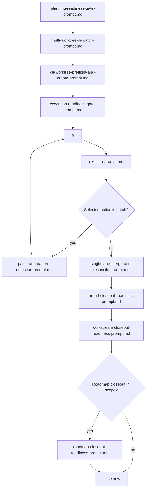
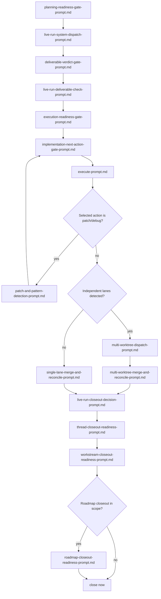

# Prompt Templates

Use these prompts as linked ladders, not as one long linear list.

For multi-step procedures with decision gates, use workflow docs under:

- [../workflows/workflow-roadmap-to-closeout.md](../workflows/workflow-roadmap-to-closeout.md)
- [../workflows/workflow-drift-detection-and-reconciliation.md](../workflows/workflow-drift-detection-and-reconciliation.md)
- [../workflows/workflow-spec-to-plan-to-execution.md](../workflows/workflow-spec-to-plan-to-execution.md)
- [../workflows/workflow-multi-worktree-execution.md](../workflows/workflow-multi-worktree-execution.md)
- [../workflows/workflow-live-run-system.md](../workflows/workflow-live-run-system.md)
- [../workflows/workflow-live-run-scenario-planning.md](../workflows/workflow-live-run-scenario-planning.md)
- [../workflows/workflow-live-run-preflight-check.md](../workflows/workflow-live-run-preflight-check.md)
- [../workflows/workflow-live-run-execution.md](../workflows/workflow-live-run-execution.md)
- [../workflows/workflow-live-run-debugging.md](../workflows/workflow-live-run-debugging.md)
- [../workflows/workflow-live-run-verification.md](../workflows/workflow-live-run-verification.md)
- [../workflows/workflow-live-run-closeout.md](../workflows/workflow-live-run-closeout.md)

## Core Planning Ladder

1. [intent-prompt.md](./intent-prompt.md)
2. [master-workstream-roadmap-build-prompt.md](./master-workstream-roadmap-build-prompt.md)
3. [registered-workstream-set-build-prompt.md](./registered-workstream-set-build-prompt.md)
4. [bounded-change-thread-build-prompt.md](./bounded-change-thread-build-prompt.md)
5. [thread-set-to-spec-set-prompt.md](./thread-set-to-spec-set-prompt.md) (if multi-thread/spec set)
6. [spec-set-to-spec-authoring-map-prompt.md](./spec-set-to-spec-authoring-map-prompt.md) (if needed)
7. [spec-prompt.md](./spec-prompt.md)
8. [spec-set-execution-map-prompt.md](./spec-set-execution-map-prompt.md) (if multi-spec sequencing needed)
9. [plan-prompt.md](./plan-prompt.md)

## Execution Ladder

1. [planning-readiness-gate-prompt.md](./planning-readiness-gate-prompt.md)
2. If `need_spec`, run [spec-prompt.md](./spec-prompt.md), then [plan-prompt.md](./plan-prompt.md).
3. If `need_plan`, run [plan-prompt.md](./plan-prompt.md).
4. If `ready_for_execution_gates`, run [execution-readiness-gate-prompt.md](./execution-readiness-gate-prompt.md).
5. [implementation-next-action-gate-prompt.md](./implementation-next-action-gate-prompt.md)
6. [execute-prompt.md](./execute-prompt.md)
7. If selected action is a patch, run [patch-and-pattern-detection-prompt.md](./patch-and-pattern-detection-prompt.md).
8. Repeat readiness/next-action/execute loop until closure-ready or blocked.

## Bug Handling Map

| Situation | Prompt |
|---|---|
| New bug, route unknown | [bug-intake-and-routing-prompt.md](./bug-intake-and-routing-prompt.md) |
| Audit bundle authoring/repair for qualifying failure | [audit-report-with-evidence-prompt.md](./audit-report-with-evidence-prompt.md) |
| Post-audit remediation routing (plan-first vs patch-now) | [post-audit-plan-and-patch-prompt.md](./post-audit-plan-and-patch-prompt.md) |
| Patch implementation + pattern scan | [patch-and-pattern-detection-prompt.md](./patch-and-pattern-detection-prompt.md) |
| Post-patch regression scope decision | [post-patch-regression-scope-prompt.md](./post-patch-regression-scope-prompt.md) |
| Deferred likely/risk finding capture | [known-issue-capture-prompt.md](./known-issue-capture-prompt.md) |

## Multi-Worktree Prompt Ladder

Use in this order:

1. [planning-readiness-gate-prompt.md](./planning-readiness-gate-prompt.md)
2. [multi-worktree-dispatch-prompt.md](./multi-worktree-dispatch-prompt.md)
3. [git-worktree-preflight-and-create-prompt.md](./git-worktree-preflight-and-create-prompt.md)
4. [execution-readiness-gate-prompt.md](./execution-readiness-gate-prompt.md)
5. [implementation-next-action-gate-prompt.md](./implementation-next-action-gate-prompt.md)
6. [execute-prompt.md](./execute-prompt.md)
7. [patch-and-pattern-detection-prompt.md](./patch-and-pattern-detection-prompt.md) (when selected action is a patch)
8. [single-lane-merge-and-reconcile-prompt.md](./single-lane-merge-and-reconcile-prompt.md)
9. [thread-closeout-readiness-prompt.md](./thread-closeout-readiness-prompt.md)
10. [workstream-closeout-readiness-prompt.md](./workstream-closeout-readiness-prompt.md)
11. [roadmap-closeout-readiness-prompt.md](./roadmap-closeout-readiness-prompt.md) (if roadmap closure is in scope)
12. [next-actions-toward-closure-prompt.md](./next-actions-toward-closure-prompt.md) (when reconciliation passed and final merge/push execution is needed)

Merge policy note:
- use [multi-worktree-merge-and-reconcile-prompt.md](./multi-worktree-merge-and-reconcile-prompt.md) only when lanes were split across multiple worktrees
- use [single-lane-merge-and-reconcile-prompt.md](./single-lane-merge-and-reconcile-prompt.md) for single-lane work

## Live-Run Prompt Ladder

Use in this order:

1. [planning-readiness-gate-prompt.md](./planning-readiness-gate-prompt.md)
2. [live-run-system-dispatch-prompt.md](./live-run-system-dispatch-prompt.md)
3. [deliverable-verdict-gate-prompt.md](./deliverable-verdict-gate-prompt.md)
4. [live-run-deliverable-check-prompt.md](./live-run-deliverable-check-prompt.md)
5. [execution-readiness-gate-prompt.md](./execution-readiness-gate-prompt.md)
6. [implementation-next-action-gate-prompt.md](./implementation-next-action-gate-prompt.md)
7. [execute-prompt.md](./execute-prompt.md)
8. [patch-and-pattern-detection-prompt.md](./patch-and-pattern-detection-prompt.md) (when selected action is a patch/debug lane)
9. [multi-worktree-dispatch-prompt.md](./multi-worktree-dispatch-prompt.md) (when independent lanes are detected)
10. [multi-worktree-merge-and-reconcile-prompt.md](./multi-worktree-merge-and-reconcile-prompt.md) (if lane split happened)
11. [live-run-closeout-decision-prompt.md](./live-run-closeout-decision-prompt.md)
12. [thread-closeout-readiness-prompt.md](./thread-closeout-readiness-prompt.md)
13. [workstream-closeout-readiness-prompt.md](./workstream-closeout-readiness-prompt.md)
14. [roadmap-closeout-readiness-prompt.md](./roadmap-closeout-readiness-prompt.md) (if roadmap closure is in scope)

## Closeout Ladder

Use in this order:

1. [thread-closeout-readiness-prompt.md](./thread-closeout-readiness-prompt.md)
2. [workstream-closeout-readiness-prompt.md](./workstream-closeout-readiness-prompt.md)
3. [roadmap-closeout-readiness-prompt.md](./roadmap-closeout-readiness-prompt.md)
4. [single-lane-merge-and-reconcile-prompt.md](./single-lane-merge-and-reconcile-prompt.md) (for single-lane PR/merge + reconciliation)
5. [multi-worktree-merge-and-reconcile-prompt.md](./multi-worktree-merge-and-reconcile-prompt.md) (for multi-lane PR/merge + reconciliation)
6. [next-actions-toward-closure-prompt.md](./next-actions-toward-closure-prompt.md) (for deterministic final closure action execution)

## Reconciliation Ladder (After Roadmap Format Change)

1. [downstream-reconciliation-after-roadmap-format-change.md](./downstream-reconciliation-after-roadmap-format-change.md)
2. [implementation-next-action-gate-prompt.md](./implementation-next-action-gate-prompt.md)
3. Continue into Closeout Ladder when blockers are resolved.

## Drift And Alignment Ladder

1. [validate-or-drift-prompt.md](./validate-or-drift-prompt.md)
2. [roadmap-vs-execution-divergence-prompt.md](./roadmap-vs-execution-divergence-prompt.md)
3. [workstream-completion-and-intent-check-prompt.md](./workstream-completion-and-intent-check-prompt.md) (if completion verdict is needed)

## Routing Helpers

- [roadmap-to-workstream-prompt.md](./roadmap-to-workstream-prompt.md)
- [workstream-to-spec-prompt.md](./workstream-to-spec-prompt.md)
- [workstream-alignment-review-prompt.md](./workstream-alignment-review-prompt.md)
- [brainstorming-detailed-report-generation-prompt.md](./brainstorming-detailed-report-generation-prompt.md)
- [roadmap-gap-prompt.md](./roadmap-gap-prompt.md)
- [refactor-ssot-symmetry-invariance-prompt.md](./refactor-ssot-symmetry-invariance-prompt.md)
- [parallel-bounded-change-planning-prompt.md](./parallel-bounded-change-planning-prompt.md)
- [planning-readiness-gate-prompt.md](./planning-readiness-gate-prompt.md)
- [deliverable-verdict-gate-prompt.md](./deliverable-verdict-gate-prompt.md)
- [execution-readiness-gate-prompt.md](./execution-readiness-gate-prompt.md)
- [multi-worktree-dispatch-prompt.md](./multi-worktree-dispatch-prompt.md)
- [git-worktree-preflight-and-create-prompt.md](./git-worktree-preflight-and-create-prompt.md)
- [single-lane-merge-and-reconcile-prompt.md](./single-lane-merge-and-reconcile-prompt.md)
- [multi-worktree-merge-and-reconcile-prompt.md](./multi-worktree-merge-and-reconcile-prompt.md)
- [next-actions-toward-closure-prompt.md](./next-actions-toward-closure-prompt.md)

## Live Run Helpers

- [live-run-system-dispatch-prompt.md](./live-run-system-dispatch-prompt.md)
- [live-run-closeout-decision-prompt.md](./live-run-closeout-decision-prompt.md)

Live-run + multi-worktree integration:
- use [../workflows/workflow-live-run-system.md](../workflows/workflow-live-run-system.md) as the orchestrator
- when independent failure/fix lanes are detected, route to [../workflows/workflow-multi-worktree-execution.md](../workflows/workflow-multi-worktree-execution.md)
- return to live-run verification/closeout after merge and evidence reconciliation

## Maintenance Helpers

- [thread-checkpoint-result-pack-prompt.md](./thread-checkpoint-result-pack-prompt.md)
- [required-root-doc-update-prompt.md](./required-root-doc-update-prompt.md)
- [readme-update-prompt.md](./readme-update-prompt.md)
- [docs-update-prompt.md](./docs-update-prompt.md)
- [starter-baseline-sync-prompt.md](./starter-baseline-sync-prompt.md)
- [managed-metadata-update-prompt.md](./managed-metadata-update-prompt.md)
- [mode-migration-prompt.md](./mode-migration-prompt.md)
- [provider-history-sync-prompt.md](./provider-history-sync-prompt.md)
- [runtime-deploy-and-verify-prompt.md](./runtime-deploy-and-verify-prompt.md)
- [gitnexus-refresh-prompt.md](./gitnexus-refresh-prompt.md)
- [audit-report-with-evidence-prompt.md](./audit-report-with-evidence-prompt.md)
- [patch-and-pattern-detection-prompt.md](./patch-and-pattern-detection-prompt.md)
- [planning-readiness-gate-prompt.md](./planning-readiness-gate-prompt.md)
- [execution-readiness-gate-prompt.md](./execution-readiness-gate-prompt.md)
- [bug-intake-and-routing-prompt.md](./bug-intake-and-routing-prompt.md)
- [post-patch-regression-scope-prompt.md](./post-patch-regression-scope-prompt.md)
- [known-issue-capture-prompt.md](./known-issue-capture-prompt.md)

## Notes

- Use the smallest ladder that matches your current state.
- Prefer prompt prerequisites and next-prompt links over ad hoc prompt jumping.
- `Related Skills` sections are intentionally added only to high-impact prompts.
- `operating_system` remains a parallel branch when work is repo-method, not product-direction.
- Use `prompt_templates/` for single prompts; use `workflows/` for sequenced procedures.
