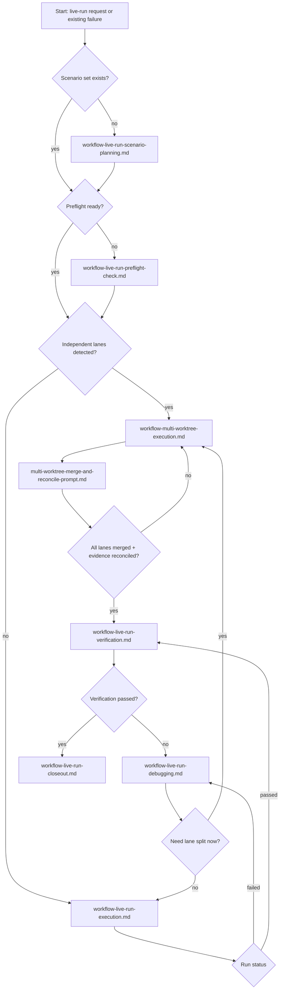

# Live Run System Workflow

## Goal

Orchestrate the full live-run lifecycle by routing to the correct modular
sub-workflow based on current state and run signals.

## Lifecycle States

1. Scenario definition ready or missing.
2. Preflight readiness pass or fail.
3. Execution success or failure.
4. Verification pass or fail.
5. Closeout ready or blocked.

## Routing Logic

1. If no validated scenario set exists for the target path, route to
   `workflow-live-run-scenario-planning.md`.
2. If scenario exists but preflight evidence is missing/incomplete, route to
   `workflow-live-run-preflight-check.md`.
3. If preflight passes and no run result exists yet, route to
   `workflow-live-run-execution.md`.
4. If run result is failure and independent lanes are identifiable, route to
   `workflow-multi-worktree-execution.md`.
5. If run result is failure and lane splitting is not justified, route to
   `workflow-live-run-debugging.md`.
6. If run result is success, route to `workflow-live-run-verification.md`.
7. If multi-worktree merge/reconcile is complete with evidence aligned, route
   to `workflow-live-run-verification.md`.
8. If verification passes and closure evidence is complete, route to
   `workflow-live-run-closeout.md`.
9. If verification fails or regressions appear, route back to
   `workflow-live-run-debugging.md`.

## Partial Entry Rules

- If a known failure already exists, enter directly at debugging.
- If multi-worktree lanes already exist, enter at
  `multi-worktree-merge-and-reconcile-prompt.md` or verification based on
  current evidence state.
- If execution already succeeded and artifacts exist, enter at verification.
- If a closeout draft exists with open gaps, enter at closeout.

## Flow Overview

## Exit Criteria

- A concrete next workflow is selected.
- Selection is justified by current artifacts/signals.
- No blind transition is made without required evidence.
